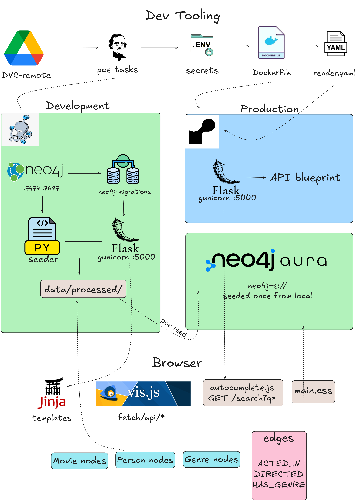
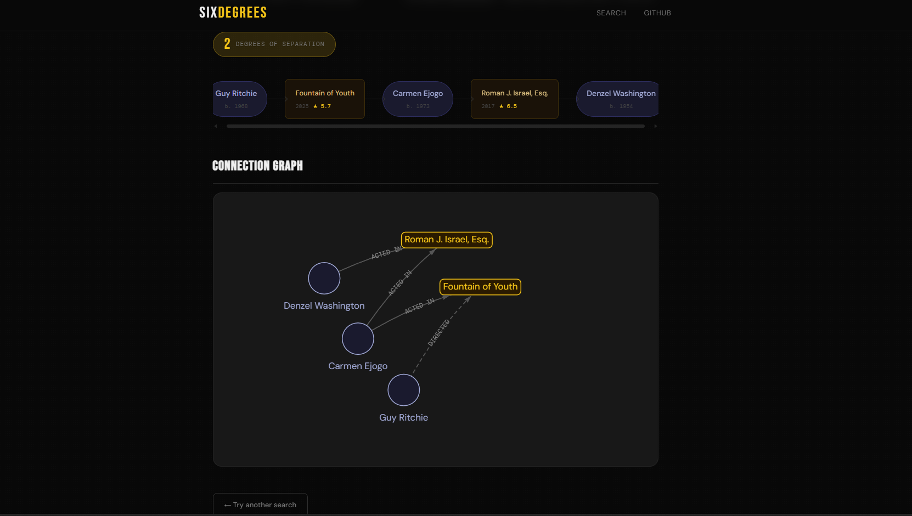
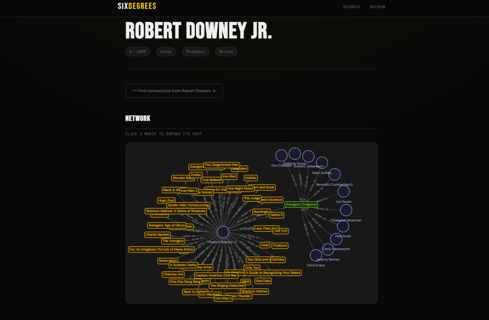

# the Kevin Bacon problem — solved.

---

## Architecture



---

## Blueprints

**Path result** — filmstrip chain + interactive graph



**Person page** — ego network with click-to-expand cast



---

## Stack

| Layer | Local | Production |
|---|---|---|
| Database | Neo4j (Docker) | Neo4j Aura free |
| Backend | Flask + gunicorn | Flask + gunicorn |
| Hosting | Docker Compose | Render |
| Graph viz | vis-network.js | vis-network.js |
| Data pipeline | pandas + DVC | — |

---

## Local development

Requires Docker, uv, and DVC configured with Google Drive credentials.

```bash
poe start   # dvc pull → docker compose up
poe stop    # docker compose down
```

Brings up the full stack: Neo4j → Migrations → Seeder → Flask at `http://localhost:5000`.

## Production

Flask runs on Render connected to Neo4j Aura. Database is seeded once from local:

```bash
poe migrate_aura   # run schema migrations against Aura
poe seed           # push data/processed/ to Aura
```

Required environment variables in the Render dashboard:

```
NEO4J_URI
NEO4J_USER
NEO4J_PASSWORD
NEO4J_DATABASE
NEO4J_BOLT_BROWSER_URI
```

---

## Data

[IMDB Non-Commercial Datasets](https://datasets.imdbws.com/) + [MovieLens](https://grouplens.org/datasets/movielens/) — filtered.

| | |
|---|---|
| Movies | 25,743 |
| People | 116,089 |
| Relationships | 331,297 |

---

## LICENCE

IMDB data — [Non-Commercial License](https://developer.imdb.com/non-commercial-datasets/).

MovieLens data — [GroupLens License](https://files.grouplens.org/datasets/movielens/ml-latest-README.html).